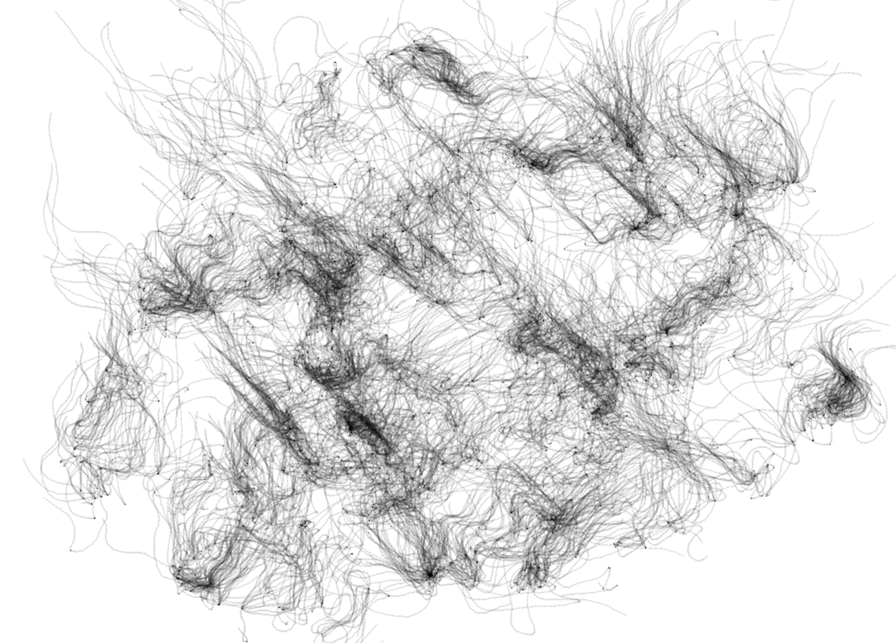

# Week9 Quiz
## Part 1: Imaging Technique Inspiration
The artwork chosen by our group is "Ntange II (Grass)" by Emily Kame Kngwarreye. Its unique point painting method combines point, line, and surface elements with natural elements. Based on this idea, I collected the following sources of inspiration.

  

Yayoi Kusama frequently employs dot elements and organizes them in rhythmic, repetitive patterns. Through this structured arrangement, the dots often form flowing lines that evoke a sense of organic growth and vitality.

  

Wu Guanzhong’s work Spring Breeze Has Awoken the Southern Shore conveys the unique vitality of spring through seemingly chaotic lines. The freely scattered dot elements also reflect the dynamic beauty of natural growth—irregular yet full of life.

The most direct inspiration I drew from these two works is the use of dots and lines to create a sense of movement, expressing the dynamic vitality inherent in nature.

## Part 2: Coding Technique Exploration
In this case, the display() function generates smooth lines and dots, mimicking the organic growth seen in the visual inspirations from Part 1. Meanwhile, the update() function introduces dynamic and random movement to the particles, enhancing the sense of liveliness. In the Particle class constructor, the variable randDegrees is used to randomize the particles' speed and direction, capturing the unpredictable and vibrant nature of growth.

### The Coding Technique in Action
[Technology Source](https://openprocessing.org/sketch/2541283)

